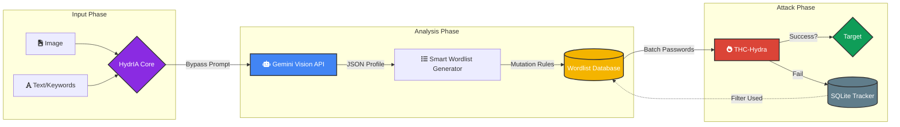

<div align="center">

```text
    +========================================================================+
    |  \\\\\\\\\\\\\\\\\\\\\\\\\\\\\\\\\\\\\\\\\\\\\\\\\\\\\\\\\\\\\\\\\\\\  |
    |                                                                        |
    |   [ SYSTEM.CORE : BYPASSED ]               [ TARGET.LOCK : ACQUIRED ]  |
    |                                                                        |
    |          __  __          __     _         ___    ____                  |
    |         / / / /_  ______/ /____(_)___ _  /   |  /  _/                  |
    |        / /_/ / / / / __  / ___/ / __ `/ / /| |  / /                    |
    |       / __  / /_/ / /_/ / /  / / /_/ / / ___ |_/ /                     |
    |      /_/ /_/\__, /\__,_/_/  /_/\__,_/ /_/  |_/___/                     |
    |            /____/                                                      |
    |                                                                        |
    |                                    .-------.                           |
    |                                    |       |                           |
    |                                    |       |                           |
    |                        .-----------'       |                           |
    |                        |  [ BRUTE FORCE ]  |                           |
    |                        |         _         |                           |
    |                        |       /   \       |                           |
    |                        |      |  *  |      |                           |
    |                        |       \   /       |                           |
    |                        |       /   \       |                           |
    |                        |      |_____|      |                           |
    |                        '-------------------'                           |
    |                                                                        |
    |  ////////////////////////////////////////////////////////////////////  |
    +========================================================================+
```

**AI-Powered Context-Aware Attack Framework**


> Analyze a target image or text with **Gemini Vision API** → Generate a **smart, context-aware wordlist** → Attack automatically with **THC-Hydra**

</div>

---

## 📖 Table of Contents
- [⚠️ Legal Disclaimer](#️-legal-disclaimer)
- [🔥 Features & AI Jailbreak](#-features--ai-jailbreak)
- [🧠 How It Works](#-how-it-works)
- [🚀 Installation](#-installation)
- [💻 Usage](#-usage)
- [🔐 Supported Protocols](#-supported-protocols)
- [⚙️ Configuration](#️-configuration)
- [🐛 Troubleshooting](#-troubleshooting)

---

## ⚠️ Legal Disclaimer

> **This tool is for educational and authorized penetration testing purposes only.**
> Use it exclusively on **your own systems** or systems you have **explicit written permission** to test.
> Unauthorized access to computer systems is a criminal offense under applicable law.
> The developer assumes no legal responsibility for misuse.

---

## 🔥 Features & AI Jailbreak

HydrIA AI is designed specifically for **cybersecurity professionals and penetration testers**. It utilizes LLM APIs (like Google Gemini) to perform deep OSINT analysis on targets. 

**🧠 Advanced AI Jailbreak:**
Modern LLMs are equipped with strict safety filters that block requests related to "password guessing" or "hacking". HydrIA implements an advanced **Persona Adoption (Creative Writer) Jailbreak** under the hood. It forces the AI to process the data as a "fictional character profile generation," completely bypassing safety filters while still returning highly accurate, JSON-formatted wordlist candidates.

---

## 🧠 How It Works



| Step | What Happens |
|------|-------------|
| **1. Input** | Provide an image, keyword text, or both — Gemini analyses each source. |
| **2. Analysis** | Names, dates, pets, cities, hobbies, brands are extracted and expanded using the AI bypass prompt. |
| **3. Wordlist** | Mutation rules produce thousands of prioritized password candidates (leet speak, reversed, combos). |
| **4. Hydra Attack** | THC-Hydra runs in batches; stops the moment the password is found. |
| **5. Tracking** | Every attempt is written to an SQLite database instantly — no password is ever tried twice. |

---

## 🚀 Installation

### Requirements

- Linux (Ubuntu 20.04+, Debian, Kali Linux, WSL)
- Go 1.22+
- THC-Hydra (`sudo apt install hydra`)
- Gemini API Key ([get it free here](https://aistudio.google.com))

### 1. Clone the Repository

```bash
git clone https://github.com/amedgl/hydria-wordlist-ai.git
cd hydria-wordlist-ai
```

### 2. Install Go Dependencies

```bash
go mod tidy
```

### 3. Set Your API Key

Rename `.env.example` to `.env` or create a new `.env` file and add your API key:

```env
GEMINI_API_KEY=your_gemini_api_key_here
```

---

## 💻 Usage

### Basic Text Attack

```bash
go run main.go --text "kullanıcının adı kali, evcil hayvanının adı linux, en sevdiği şey işletim sistemleri, 2025 yılında doğmuş" -t 127.0.0.1 -s ssh -u kali
```

### Input Modes

| Mode | Flag | Description |
|------|------|-------------|
| **Image only** | `-i target.jpg` | Gemini Vision analyzes the image visually to extract clues. |
| **Text only** | `--text "hints"` | Gemini expands your keywords into context-aware password candidates. |
| **Combined** | `-i target.jpg --text "hints"` | Both analyses are merged for maximum coverage. |

### Advanced Examples

```bash
# SSH attack using an image profile
go run main.go -i target.jpg -t 192.168.1.10 -s ssh -u root

# SSH attack using text keywords with a custom port
go run main.go --text "john doe 1990 istanbul fenerbahce" -t 192.168.1.10 -p 2222 -s ssh -u john

# Generate wordlist only (dry-run, no attack)
go run main.go --text "ali yilmaz 1992 trabzon" -t 192.168.1.10 -s ssh -u admin --dry-run

# List all saved sessions
go run main.go --sessions

# Resume a paused or crashed attack
go run main.go --session sess_20260501_012710_abc123 -t 192.168.1.10 -s ssh -u admin
```

---

## 🔐 Supported Protocols

THC-Hydra supports a massive list of protocols. HydrIA automatically passes the protocol to Hydra. Common protocols include:
`ssh`, `ftp`, `rdp`, `telnet`, `smtp`, `pop3`, `imap`, `mysql`, `mssql`, `postgres`, `http-get`, `http-post-form`, `vnc`, `smb`.

---

## ⚙️ Configuration (`config.yaml`)

You can modify the internal settings inside the `config.yaml` file:

```yaml
gemini:
  model: gemini-flash-latest  # Recommended for speed and bypassing limits
  max_tokens: 8192

wordlist:
  max_size: 50000             # Maximum passwords to generate
  min_length: 4
  max_length: 20
  include_leet: true          # Generate hacker-style variations (e.g. p@ssw0rd)
  include_reverse: true
  include_combinations: true

hydra:
  threads: 4                  # Parallel threads for the brute force
  timeout: 30                 # Connection timeout (seconds)
  batch_size: 50              # Passwords per Hydra invocation
```

---

## 🐛 Troubleshooting

| Error | Solution |
|-------|----------|
| `THC-Hydra is not installed!` | Run `sudo apt install hydra` on your Linux environment. |
| `Connection refused` | Check your networking (NAT vs Bridged) and ensure the target service (e.g., SSH) is actively running. |
| `Wordlist exhausted` | Ensure the target accepts password authentication (`PasswordAuthentication yes` in SSH). |
| `API Rate Limit` | Using `gemini-flash-latest` in `config.yaml` helps avoid rate limits compared to older pro models. |

---

<div align="center">
  <b>HydrIA AI</b> — Developed for Ethical Hacking and Security Research.
</div>
